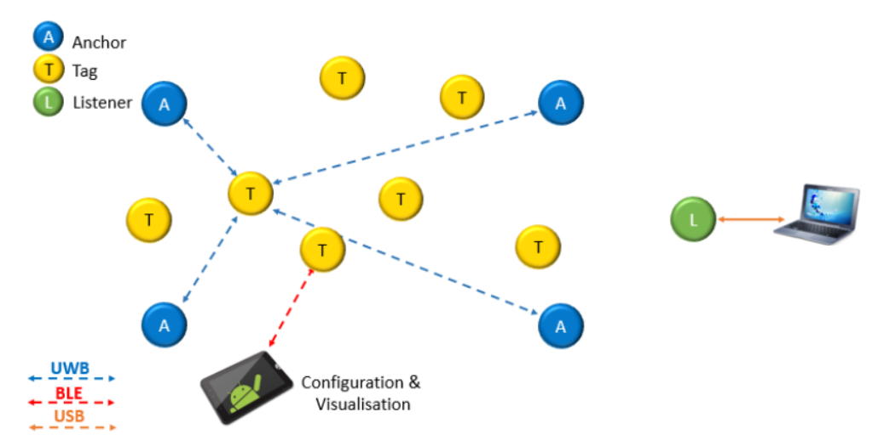

# Simulating Decawave UWB data with ROS2

Simulate, store and view Decawave UWB listener data

## Requirements

This program was made with `Python 3.10` and `ROS2 Humble` using `ubuntu 22.03`. click on the following links to check installation steps:

[Python installation](https://www.python.org/downloads/)

[ROS2 humble](https://docs.ros.org/en/humble/Installation.html)

## Installation

After you have installed python and ROS2 humble into your ubuntu system, create a workspace for this repo and move into it:

```linux
mkdir -p decawave_ws/src
cd decawave_ws/src
```

now you can clone this repo:

```linux
git clone https://github.com/Xpect8tions/Decawave-ros-data-sim
```

next, move back one directory to build your workspace:

```linux
cd ..
colcon build
```

now you should see the `build`, `install` and `log` folders along side the `src` directory you created. Once all that has been done, you can start testing the code.

# How it works

There are 2 directories in this repo, `launchers` and `locator`.

The `locator` directory contains a python file, `serial_pub.py` that publishes a string to the `/outputs` topic. This string contains deatils on the anchor and tag locations. This publisher assumes that one of the UWB devices are setup as a listener and plugged into the serial port on a computer.



The `launchers` directory contains a launch file `serial.launch.py` that launches a python program `new_serial_sub.py`. This program contains a subscriber that subscribes to the `/outputs` topic and processes the data before storing it into a CSV `locator/logging/DWranging.csv`.


<span class="caption"> The [above image](docs/RVIZ.png) shows the RVIZ view of the UWB anchors and tags where the red cylinders are the anchors and the blue cylinder is the tag.</span>
