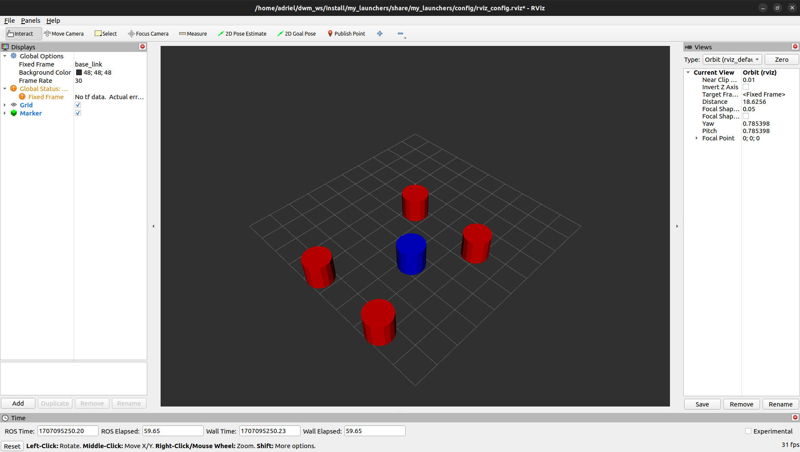
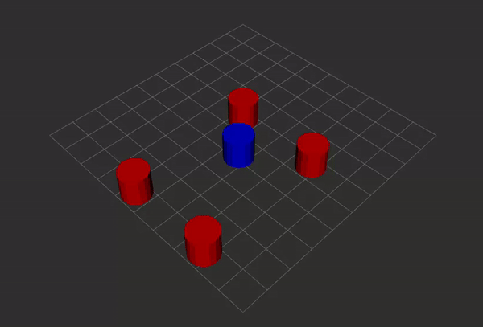

# Simulating Decawave UWB data with ROS2

Simulate, store and view Decawave UWB listener data

## Requirements

This program was made with `Python 3.10` and `ROS2 Humble` using `ubuntu 22.03`. click on the following links to check installation steps:

[Python installation](https://www.python.org/downloads/)

[ROS2 humble](https://docs.ros.org/en/humble/Installation.html)

## Installation

After you have installed python and ROS2 humble into your ubuntu system, you can clone this repo:

```bash
git clone https://github.com/Xpect8tions/Decawave-ros-data-sim
```

next, move into the directory to build your workspace:

```bash
cd Decawave-ros-data-sim
colcon build
```

now you should see the `build`, `install` and `log` folders along side the `src` directory. Once all that has been done, you can start testing the code.

# How it works

There are 2 directories in this repo, `/launchers` and `/locator`.

The `/locator` directory contains a python file, `serial_pub.py` that publishes a string to the `/outputs` topic. This string contains deatils on the anchor and tag locations. This publisher simulates the data from a Decawave (now Qorvo) UWB device is setup as a listener and plugged into the serial port on a computer (see image below).

")

The `/launchers` directory contains a launch file, `serial.launch.py` that launches a python program `new_serial_sub.py`. This program contains a subscriber that subscribes to the `/outputs` topic and processes the data before storing it into a CSV `locator/logging/DWranging.csv`.

When launching this program, RViz will also get launched. The data that the subscriber has processed is then passed on to the RViz publisher to view the location of the tags and anchors.



_The red cylinders are the anchors and the blue cylinder is the tag_

# Running the programs

Both the files mentioned above need to be run simultaneously to be able to see how the program works properly.

open 2 seperate terminals and enter the workspace in both terminals:

```bash
cd Decawave-ros-data-sim
```

remember to source ROS2 and install:

```bash
source /opt/ros/<distro>/setup.bash
source install/setup.bash
```

in one terminal, run:

```bash
ros2 launch launcher serial.launch.py
```

in the other terminal, run:

```bash
ros2 run locator serial_pub.py
```

you should see an RViz window open with 4 red cylinders and 1 blue one. The blue one should be moving toward the bottom corner.


